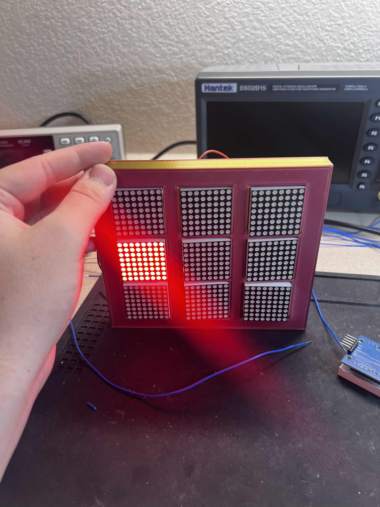

```
yay -S esp-idf
/opt/esp-idf/install.sh 
git config --global --add safe.directory /opt/esp-idf

. /opt/esp-idf/export.sh
idf.py set-target esp32
idf.py build


```


Steps to Compile the program
```
# run the export script
. /opt/esp-idf/export.sh

# Go to one of the server's code
## go to client
cd client-server/client
## go to server
cd client-server/server

# build the code
idf.py build

# flash the board
sudo idf.py flash
```

1. **Set the ESP32 target** (if you haven’t done so already or if you need to specify a particular ESP32 chip variant):
   ```bash
   idf.py set-target esp32
   ```

2. **Configure the project** (optional, required only if you need to change project configurations or if it's the first build):
   ```bash
   idf.py menuconfig
   ```
   - Navigate through the menuconfig if you need to customize your build configurations. Save and exit.

3. **Clean the project** (optional, recommended when switching between client and server builds to avoid conflicts):
   ```bash
   idf.py fullclean
   ```

4. **Build the project**:
   - For the client or server, depending on the environment variable set or the conditional configuration in your `CMakeLists.txt`, simply run:
     ```bash
     idf.py build
     ```
   - This command compiles the project, and if successful, generates the firmware binaries.

5. **Flash the firmware to the ESP32** (ensure your device is connected):
   ```bash
   idf.py -p (PORT) flash
   ```
   Replace `(PORT)` with the COM port your ESP32 is connected to (e.g., `COM3` on Windows or `/dev/ttyUSB0` on Linux/Mac).

6. **Monitor the output** (optional):
   ```bash
   idf.py -p (PORT) monitor
   ```
   This command opens the serial output monitor. Use `CTRL+]` to exit the monitor.
